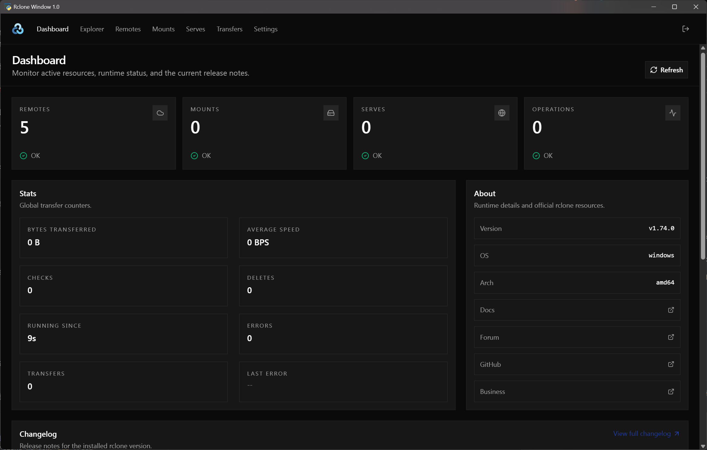

# Rclone Window

A simple program that opens rclone's gui command in its own window instead the Web browser.

## About

Starting in rclone 1.74.0, the `rclone gui` command is available. It launches a revamped web UI for rclone. The command runs rclone rc (remote control) server, runs the web interface on top of it, and opens the user's browser.

Rclone Window simply redirects the web interface through a webview window for a more native feel.

## Requirements

- Windows 10 or 11
- rclone 1.74.0+

## Config

A toml config file is generated when running Rclone Window for the first time. It contains the following sections:

webgui\
    - address - address gui command should host from. Default: 127.0.0.1\
    - port - port gui command should use. Default: 3000\
    - user - username for gui. Default: user\
    - pass - password for gui. Default: password

rc\
    - address - address rc command should host from. Default: 127.0.0.1\
    - port - port rc command should use. Default: 2000\
    - user - username for rc command. Default: admin\
    - pass - password for rc command. Default: password

webview\
    - port - port Rclone Window should host from. Default: 1000

All options are required. However, unless you need to change the rc username, password or any of the ports, you won't need to touch the config file.

Please read up on [rclone gui command](https://rclone.org/gui/) for more details on how to use the actual web interface.